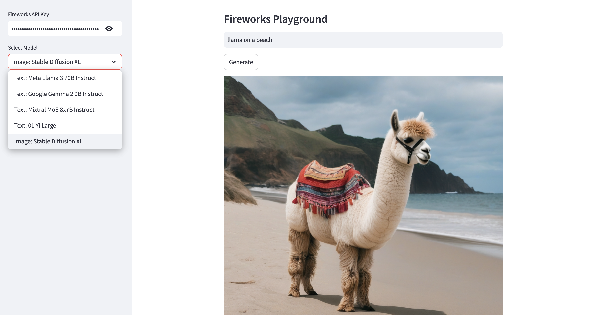

# 🎆 Fireworks AI Enhanced Playground

A futuristic, Docker-ready AI playground that combines multiple AI providers (Fireworks AI and DeepInfra) with advanced features including web search, embeddings, deep search, and Model Context Protocol (MCP) support.



## ✨ Features

### Core Features
- 🤖 **Multi-Provider Support**: Access 100+ models from Fireworks AI and DeepInfra
- 💬 **Text Generation**: Advanced language models including Llama 3.1, Mixtral, Qwen, and more
- 🖼️ **Image Generation**: Stable Diffusion XL, Playground v2, and other image models
- 🔍 **Web Search Integration**: Real-time web search powered by SerpAPI
- 🔬 **Deep Search**: Multi-level deep search with recursive query expansion

### Advanced Features
- 🧠 **Embeddings & Vector Search**: PostgreSQL with pgvector for semantic search
- 📋 **Model Context Protocol (MCP)**: Standardized context management across providers
- 🎯 **Result Reranking**: Intelligent reranking using cosine similarity and hybrid scoring
- 💾 **ChromaDB Integration**: Vector database for storing and retrieving findings
- 🐳 **Docker-Ready**: Complete Docker Compose setup for easy deployment
- 📊 **Analytics Dashboard**: Track usage, model statistics, and search history

## 🚀 Quick Start

### Using Docker (Recommended)

1. **Clone the repository**
   ```bash
   git clone https://github.com/groxaxo/fireworks.git
   cd fireworks
   ```

2. **Set up environment variables**
   ```bash
   cp .env.example .env
   # Edit .env and add your API keys
   ```

3. **Start with Docker Compose**
   ```bash
   docker-compose up -d
   ```

4. **Access the application**
   - Streamlit UI: http://localhost:8501
   - ChromaDB: http://localhost:8000
   - PostgreSQL: localhost:5432

### Local Development

1. **Install dependencies**
   ```bash
   pip install -r requirements.txt
   ```

2. **Set up environment variables**
   ```bash
   cp .env.example .env
   # Edit .env and add your API keys
   ```

3. **Start PostgreSQL and ChromaDB** (if not using Docker)
   ```bash
   # PostgreSQL with pgvector
   docker run -d -p 5432:5432 \
     -e POSTGRES_USER=fireworks_user \
     -e POSTGRES_PASSWORD=fireworks_password \
     -e POSTGRES_DB=fireworks_db \
     ankane/pgvector:latest

   # ChromaDB
   docker run -d -p 8000:8000 chromadb/chroma:latest
   ```

4. **Run the application**
   ```bash
   streamlit run streamlit_app.py
   ```

## 🔑 API Keys

You'll need API keys from the following services:

### Required
- **Fireworks AI**: [Get API Key](https://fireworks.ai/api-keys)
  - Free tier available
  - Required for Fireworks models

- **DeepInfra**: [Get API Key](https://deepinfra.com/)
  - Free tier available
  - Required for DeepInfra models

### Optional (for enhanced features)
- **SerpAPI**: [Get API Key](https://serpapi.com/)
  - Required for web search functionality
  - Free tier: 100 searches/month

## 📋 Available Models

### Fireworks AI Models

#### Text Models
- Meta Llama 3.1 (405B, 70B, 8B)
- Mixtral MoE (8x22B, 8x7B)
- Gemma 2 (9B)
- And many more...

#### Image Models
- Stable Diffusion XL
- Stable Diffusion 3 (Large, Medium, Turbo)
- Playground v2.5
- Japanese Stable Diffusion XL

### DeepInfra Models

#### Text Models
- Meta Llama 3.1 (405B, 70B, 8B)
- Llama 3.2 Vision (90B, 11B)
- Qwen 2.5 (72B, Coder 32B)
- Microsoft WizardLM 2 (8x22B)
- Mistral & Mixtral variants
- DeepSeek Coder V2
- And 20+ more models

#### Embedding Models
- BAAI BGE (Large, Base)
- Sentence Transformers
- GTE Large
- E5 Large V2

## 🎯 Usage Examples

### Basic Text Generation

1. Select a provider (Fireworks AI or DeepInfra)
2. Choose a text model
3. Enter your prompt
4. Click "Generate"

### Image Generation

1. Select "Fireworks AI" provider
2. Choose "Image" model type
3. Select an image model
4. Describe your image
5. Click "Generate"

### Web Search Enhanced Generation

1. Enable "Web Search" in the sidebar
2. Enter your query
3. The system will:
   - Search the web for relevant information
   - Include search results in the context
   - Generate an informed response

### Deep Search

1. Enable "Deep Search" in the sidebar
2. Set search depth (1-5 levels)
3. Enter your query
4. The system will:
   - Perform recursive web searches
   - Follow related queries
   - Aggregate findings across levels

### Embeddings & Reranking

1. Enable "Use Embeddings & Reranking"
2. Your conversations will be:
   - Converted to embeddings
   - Stored in PostgreSQL with pgvector
   - Available for semantic search
   - Reranked for relevance

## 🏗️ Architecture

```
┌─────────────────────────────────────────────────────────┐
│                    Streamlit Frontend                    │
│                  (streamlit_app.py)                      │
└────────────────────┬────────────────────────────────────┘
                     │
         ┌───────────┴───────────┐
         │                       │
┌────────▼────────┐    ┌────────▼────────┐
│  Fireworks AI   │    │    DeepInfra    │
│     Models      │    │     Models      │
└─────────────────┘    └─────────────────┘
         │                       │
         └───────────┬───────────┘
                     │
         ┌───────────┴───────────────────────┐
         │                                   │
┌────────▼────────┐              ┌──────────▼─────────┐
│   Web Search    │              │   MCP Service      │
│   (SerpAPI)     │              │  (Context Mgmt)    │
└─────────────────┘              └────────────────────┘
         │                                   │
         │                       ┌───────────▼──────────┐
         │                       │   Reranker Service   │
         │                       └──────────────────────┘
         │                                   │
┌────────▼───────────────────────────────────▼─────────┐
│                Storage Layer                          │
│  ┌──────────────┐  ┌─────────────┐                  │
│  │  PostgreSQL  │  │  ChromaDB   │                  │
│  │  (pgvector)  │  │  (Vectors)  │                  │
│  └──────────────┘  └─────────────┘                  │
└──────────────────────────────────────────────────────┘
```

## 📁 Project Structure

```
fireworks/
├── streamlit_app.py          # Main Streamlit application
├── services/                  # Service modules
│   ├── __init__.py
│   ├── deepinfra_service.py  # DeepInfra API integration
│   ├── web_search_service.py # Web search functionality
│   ├── database_service.py   # PostgreSQL operations
│   ├── chroma_service.py     # ChromaDB operations
│   ├── mcp_service.py        # Model Context Protocol
│   └── reranker_service.py   # Result reranking
├── utils/                     # Utility modules
│   └── __init__.py
├── docker-compose.yml         # Docker Compose configuration
├── Dockerfile                 # Application Dockerfile
├── init_db.sql               # Database initialization
├── requirements.txt          # Python dependencies
├── .env.example              # Environment variables template
└── README.md                 # This file
```

## 🔧 Configuration

### Environment Variables

Create a `.env` file with the following variables:

```env
# API Keys
FIREWORKS_API_KEY=your_fireworks_api_key_here
DEEPINFRA_API_KEY=your_deepinfra_api_key_here
SERPAPI_KEY=your_serpapi_key_here

# Database Configuration
POSTGRES_USER=fireworks_user
POSTGRES_PASSWORD=fireworks_password
POSTGRES_DB=fireworks_db
POSTGRES_HOST=postgres
POSTGRES_PORT=5432

# ChromaDB Configuration
CHROMA_HOST=chromadb
CHROMA_PORT=8000
```

### Docker Compose Services

The `docker-compose.yml` includes:

1. **PostgreSQL with pgvector**: Vector database for embeddings
2. **ChromaDB**: Specialized vector store for findings
3. **Streamlit App**: The main application

## 🧪 Testing

Run the application in test mode:

```bash
# Test Fireworks AI connection
python -c "from services.deepinfra_service import DeepInfraService; print('OK')"

# Test database connection
python -c "from services.database_service import DatabaseService; db = DatabaseService(); db.connect(); print('OK')"

# Test ChromaDB connection
python -c "from services.chroma_service import ChromaService; cs = ChromaService(); print('OK')"
```

## 🛠️ Development

### Adding New Models

**Fireworks AI:**
1. Add model ID to the `fireworks_text_models` or `fireworks_image_models` list in `streamlit_app.py`

**DeepInfra:**
1. Add model configuration to `MODELS` dict in `services/deepinfra_service.py`

### Adding New Features

1. Create a new service in `services/`
2. Import in `streamlit_app.py`
3. Add UI controls in the sidebar
4. Integrate into the generation workflow

## 📊 Database Schema

### Embeddings Table
```sql
CREATE TABLE embeddings (
    id SERIAL PRIMARY KEY,
    content TEXT NOT NULL,
    embedding vector(1536),
    metadata JSONB,
    created_at TIMESTAMP DEFAULT CURRENT_TIMESTAMP
);
```

### Search History Table
```sql
CREATE TABLE search_history (
    id SERIAL PRIMARY KEY,
    query TEXT NOT NULL,
    results JSONB,
    model_used VARCHAR(255),
    created_at TIMESTAMP DEFAULT CURRENT_TIMESTAMP
);
```

### Deep Search Results Table
```sql
CREATE TABLE deep_search_results (
    id SERIAL PRIMARY KEY,
    query TEXT NOT NULL,
    search_depth INTEGER,
    results JSONB,
    created_at TIMESTAMP DEFAULT CURRENT_TIMESTAMP
);
```

## 🚢 Deployment

### Railway (One-Click Deploy)

[](https://railway.app/new/template/dYYPjx?referralCode=alphasec)

### Docker Hub

```bash
# Build and push
docker build -t fireworks-ai-playground .
docker push your-username/fireworks-ai-playground

# Pull and run
docker pull your-username/fireworks-ai-playground
docker run -p 8501:8501 --env-file .env fireworks-ai-playground
```

### Cloud Platforms

- **AWS**: Use ECS with the provided Dockerfile
- **Google Cloud**: Deploy to Cloud Run
- **Azure**: Deploy to Container Instances

## 🤝 Contributing

Contributions are welcome! Please feel free to submit a Pull Request.

1. Fork the repository
2. Create your feature branch (`git checkout -b feature/AmazingFeature`)
3. Commit your changes (`git commit -m 'Add some AmazingFeature'`)
4. Push to the branch (`git push origin feature/AmazingFeature`)
5. Open a Pull Request

## 📝 License

This project is licensed under the MIT License - see the [LICENSE](LICENSE) file for details.

## 🙏 Acknowledgments

- [Fireworks AI](https://fireworks.ai) for hosting ML models
- [DeepInfra](https://deepinfra.com/) for model infrastructure
- [Streamlit](https://streamlit.io) for the amazing framework
- [ChromaDB](https://www.trychroma.com/) for vector storage
- [PostgreSQL](https://www.postgresql.org/) and [pgvector](https://github.com/pgvector/pgvector)

## 📧 Support

For questions and support, please:
- Open an issue on GitHub
- Check the [documentation](https://github.com/groxaxo/fireworks)
- Visit [Fireworks AI documentation](https://docs.fireworks.ai/)

---

Built with ❤️ using Streamlit, Fireworks AI, and DeepInfra
